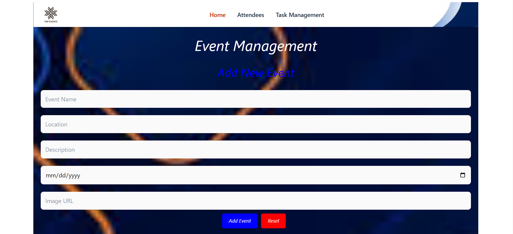
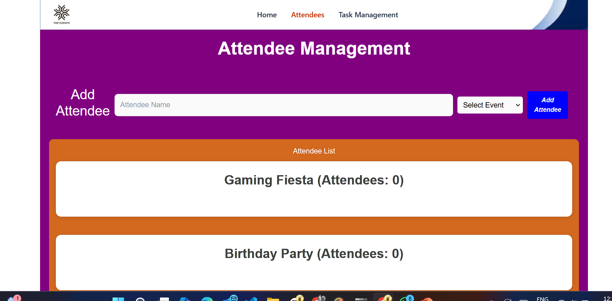
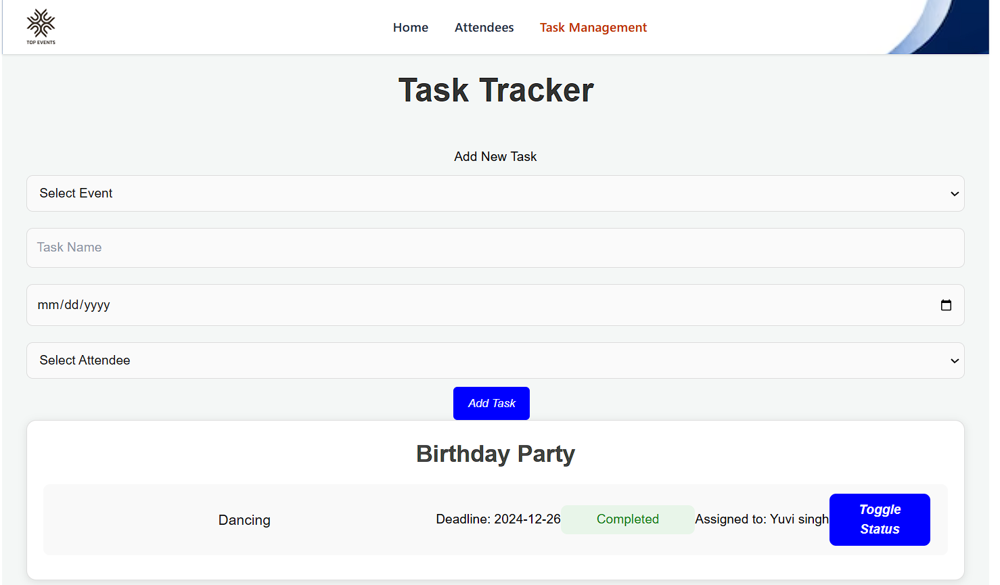

# Event Management System
#### An Event Management System built with React for the frontend and Flask for the backend. This project allows users to manage events, attendees, and tasks effectively. Users can create, edit, delete events, manage attendees, and track tasks.
- **Check the Below Link to view the Project:**  
https://event-management-system-w2fd6gyk3-yuvraaj-singhs-projects.vercel.app/

## Project Overview

#### The Event Management System simplifies event planning by allowing users to create events, manage attendees, and track associated tasks. The backend is powered by Flask, ensuring smooth API operations, while the frontend leverages React for an interactive user interface.
## Features
### Event Management
- **Create, edit, delete events.**
- **View details such as name, description, date, location, and attendees.**
### Attendee Management
- **Add, edit, and remove attendees.**
- **Assign attendees to specific events.**
### Task Tracker
- **Create and assign tasks to events.**
- **Update task status as Pending, In Progress, or Completed.**

## Technologies Used
- **Frontend: React, CSS**
- **Backend: Flask, Python**
- **Database: JSON files (as a simple data store)**
- **Tools: Fetch API, Flask-CORS**


## Screenshots

- **Home Page**


- **Event Management**


- **Task Tracker**


## Installation and Setup

### Prerequisites
Ensure you have the following installed on your system:
- **Node.js** and **npm**
- **Python 3.7+**
- **Flask** and the required Python libraries

### Setup Instructions

#### 1. Clone the Repository
```bash
git clone https://github.com/y-singh09/Event-Management-System.git
```
```bash
cd Event-Management-System
```
#### 2. Backend Setup (Flask)
#### 1.Navigate to the backend folder:
```bash
cd backend
```
#### 2.Install dependencies:
```bash
pip install -r requirements.txt
```
#### 3.Start the Flask server:
```bash
python app.py
```
#### 3. Frontend Setup (React)
#### 1.Navigate to the frontend folder:
```bash
cd frontend
```
#### 2.Install dependencies:
```bash
npm install
```
#### 3.Start the React app:
```bash
npm start
```

## How to Use

1. Open the application in your browser by navigating to [http://localhost:3000](http://localhost:3000).
2. Use the **Event Management** page to:
   - View, add, edit, and delete events.
3. Check the **Attendee Management** page for:
   - Viewing and assigning attendees to events.
4. Track progress on the **Task Tracker** page:
   - View tasks associated with each event.
   - Update task statuses (Pending/Completed).

